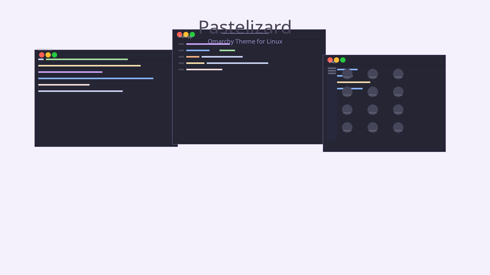

# Pastelizard Theme for Omarchy

A whimsical pastel-themed workspace with magical enchantments, inspired by the mystical world of a wizard's study where pastel colors dance with ethereal glows.



## Theme Philosophy

Pastelizard blends soft pastel tones with magical accents to create an enchanting desktop experience. The palette draws inspiration from:
- Ethereal wizard robes in lavender and mauve
- Glowing magical orbs in mint and teal
- Enchanted parchment in soft cream tones
- Mystical sparkles in pale gold

## Color Palette

| Element | Color | Hex |
|---------|-------|-----|
| Background | Pale Lavender Cream | `#F8F6FF` |
| Foreground | Soft Purple-Gray | `#4A4458` |
| Accent | Enchanted Lavender | `#9B8EC5` |
| Cursor | Mystical Mauve | `#C9A8D4` |
| Selection | Soft Lavender | `#D4B8E8` |

### Terminal Palette
- **Pink**: `#F5A3B3` - Magical wands
- **Mint**: `#A8E6CF` - Potion bubbles
- **Yellow**: `#FFEAA7` - Stardust
- **Blue**: `#A8D8EA` - Crystal balls
- **Lavender**: `#D4B8E8` - Mystical energy

## Applications

This theme covers the full Linux desktop stack:

| Application | Theme File |
|-------------|------------|
| Omarchy | `colors.toml` |
| Hyprland | `hyprland.conf` |
| Hyprlock | `hyprlock.conf` |
| Waybar | `waybar.css` |
| GTK | `gtk.css` |
| Alacritty | `alacritty.toml` |
| Ghostty | `ghostty.conf` |
| Kitty | `kitty.conf` |
| Neovim | `neovim.lua` |
| Mako | `mako.ini` |
| VSCode | `vscode.json` |
| Chromium | `chromium.theme` |
| System24 (Discord) | `system24-pastelizard.css` |
| Walker | `walker.css` |
| SwayOSD | `swayosd.css` |
| btop | `btop.theme` |

## Installation

### For Omarchy
```bash
omarchy-theme-install https://github.com/pastelizard/omarchy-pastelizard-theme.git
```

### For Vesktop/Discord
Copy the theme file to `~/.config/vesktop/themes/system24-pastelizard.css`:
```bash
cp system24-pastelizard.css ~/.config/vesktop/themes/
```

### For Other Applications
Use the [imbypass](https://github.com/imbypass/omarchy-hook-theme-set-ex/tree/main) hook script to apply theme colors to unsupported applications.

## Customization

### Changing Accent Color
Edit `colors.toml` and modify the `accent` value:
```toml
accent = "#YOUR_HEX_COLOR"
```

### Dark Mode
Currently this theme is optimized for light mode. Dark mode support coming soon.

## Author

**Pastelizard** - Enchanted Themes Collection

## License

MIT License - Feel free to use and modify!

## Credits

Inspired by [omarchy-roseofdune-theme](https://github.com/HANCORE-linux/omarchy-roseofdune-theme) by HANCORE-linux
